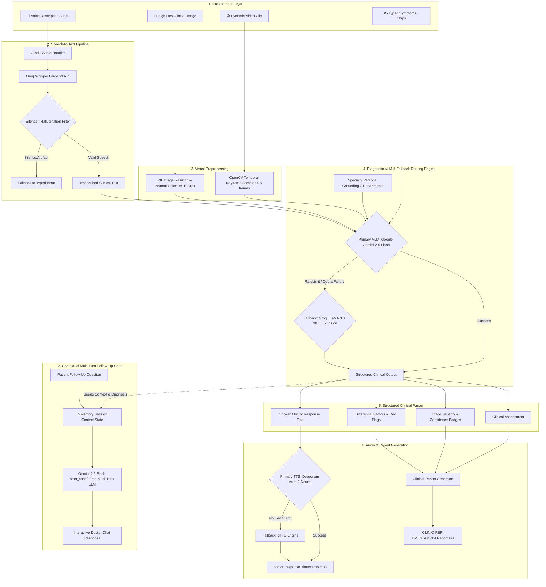

# System Architecture: AI Multimodal Health Specialist

The **AI Multimodal Health Specialist** is an intelligent, multi-specialty clinical triage platform engineered for low-latency, multimodal assessment across **Speech-to-Text (STT)**, **High-Resolution Computer Vision (VLM)**, **Dynamic Video Keyframe Analysis**, **Contextual Multi-Turn Conversation Memory**, and **Neural Text-to-Speech (TTS)**.

---

## 1. High-Level System Architecture Diagram

---

## 2. Core Subsystems & Components

### A. Speech-to-Text Subsystem (`voice_of_the_patient.py`)
- **Model**: OpenAI Whisper Large v3 hosted on **Groq Cloud LPU** (Language Processing Units).
- **Latency**: Sub-second transcription (~0.8s for 15s audio).
- **Hallucination Guard**: Custom regex and heuristic filter detecting silent audio artifacts (e.g. `"Thank you."`, `"Thanks for watching."`, `"..."`) to prevent false inputs when recording in noisy or silent environments.

### B. Vision & Video Keyframe Subsystem (`brain_of_the_doctor_groq.py`)
- **Static Images**: Pillow-based inline RGB transformation with aspect-ratio preservation (capped at 1024x1024) passed as raw image parts to the VLM.
- **Dynamic Videos**: Integrated **OpenCV (`cv2.VideoCapture`)** pipeline that samples 4–6 representative frames across the video timeline.
  - Eliminates cloud file upload delays and remote storage quota errors.
  - Provides instant zero-lag multi-frame temporal reasoning to the VLM.

### C. Clinical Brain & Routing Engine (`brain_of_the_doctor_groq.py`)
- **Primary Engine**: **Google Gemini 2.5 Flash** (`gemini-2.5-flash` / `gemini-2.0-flash` / `gemini-1.5-flash`).
- **Secondary Fallback**: **Groq LLaMA 3.3 70B Versatile** (for text) & **LLaMA 3.2 11B Vision** (for image fallback).
- **Specialist Personas**: 7 tailored department prompts:
  1. 🩺 Dermatology (Dr. Anika)
  2. 🦷 Dentistry (Dr. Priya)
  3. 👁️ Ophthalmology (Dr. Vikram)
  4. 🫀 Cardiology (Dr. Suresh)
  5. 🦴 Orthopedics (Dr. Rajiv)
  6. 🧠 Mental Health (Dr. Meera)
  7. 🏥 General Medicine (Dr. Kumar)

### D. Multi-Turn Session Memory (`gr.Chatbot` & `gr.State`)
- **State Preservation**: The initial consultation context (chief complaint, clinical findings, triage severity, differential considerations, care plan) is saved into an active session state (`consultation_context_state`).
- **Conversational Follow-Up**: Subsequent patient queries (e.g., drug interactions, home remedies, emergency warning thresholds) are answered by the specialist persona with memory of the visual and verbal diagnosis.

### E. Speech Synthesis Subsystem (`voice_of_the_doctor.py`)
- **Primary Engine**: **Deepgram Aura-2** (`aura-2-thalia-en`) neural voice synthesis producing natural doctor speech.
- **Free Fallback**: Google Text-to-Speech (**gTTS**) activated automatically if Deepgram API key is omitted or exhausted.
- **Concurrency Isolation**: Generates unique timestamped audio files (`doctor_response_{timestamp}.mp3`) with automated background cleanup of files older than the last 20 requests.

### F. Clinical Report & Export Engine (`main.py`)
- Automatically compiles structured clinical documentation matching medical hospital guidelines:
  - Official Reference ID (e.g. `CLINIC-REF-20260817-020327`)
  - Evaluation Modalities (Verbal, Photo, Video)
  - Chief Complaint
  - Primary Clinical Assessment & Triage Severity
  - Differential Factors to Monitor
  - Actionable Care Plan & Specialist Referral
  - ⚠️ Emergency Red Flags
  - Medical Legal Disclaimer & Attestation
- Exports directly to `.txt` with 1-click **`gr.File`** download.

---

## 3. Data Flow Specification

| Step | Component | Input | Output | Fallback |
|---|---|---|---|---|
| **1** | Audio STT | `.wav` / `.mp3` / `.webm` | Transcribed Text | Filter silence → Typed input |
| **2** | Visual Framing | `.mp4` / `.mov` / `.avi` | 4–6 PIL Image Frames | Direct inline frames |
| **3** | Multimodal Triage | Text + Images + Specialty | Structured Medical Text | Gemini → Groq LLaMA |
| **4** | Response Parser | Raw LLM Text | Assessment, Severity, Care Plan | Regex section extractor |
| **5** | Speech Synthesis | Doctor Audio Text | `.mp3` Audio File | Deepgram → gTTS |
| **6** | Report Builder | Parsed Metadata | Formatted `.txt` File | Local `consultation_reports/` |
| **7** | Follow-Up Chat | User Query + State | Conversational Doctor Answer | Gemini `start_chat` → Groq |

---

## 4. Security & Privacy Considerations
- **Stateless Cloud Execution**: Patient media files and voice recordings are processed in temporary volatile memory and automatically cleaned up.
- **Credential Safety**: No hardcoded API keys; all sensitive tokens are loaded via `.env` and environment variables.
- **Medical Guardrails**: Prominently displays emergency disclaimers (emergency contact numbers 112 / 911) and advises human physician validation for all high-severity concerns.
